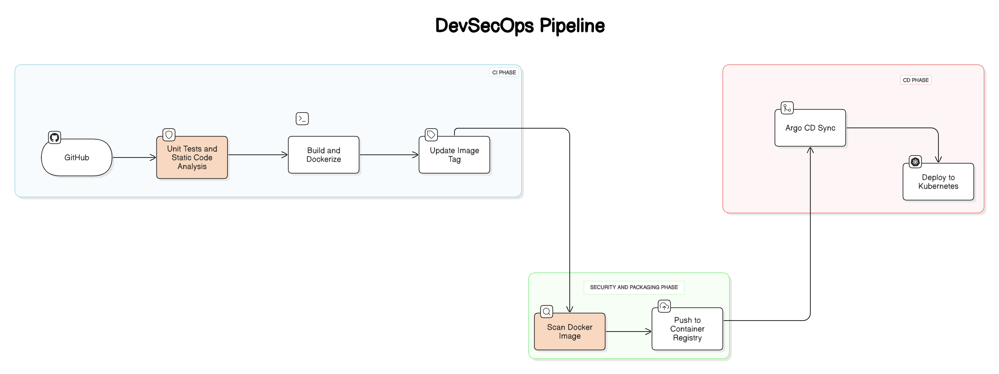

# DevSecOps Pipeline Implementation 



This repository outlines a **DevSecOps pipeline** for secure and automated CI/CD workflows. The pipeline ensures security, automation, and efficient deployment using Docker, Trivy, GitHub, Argo CD, and Kubernetes.

## 📌 Pipeline Overview

1. **Code Commit & Push (Git)** - A developer pushes code to a Git repository.
2. **Unit Testing** - Runs unit tests using **TypeScript (TS)**.
3. **Static Code Analysis** - Performs linting and security checks using **npm**.
4. **Build Process** - The application is built using **npm**.
5. **Docker Containerization** - The application is containerized using **Docker**.
6. **Security Scanning** - The built Docker image is scanned for vulnerabilities using **Trivy**.
7. **Push to GitHub** - The scanned image is pushed to **GitHub**.
8. **Update Image Tag** - A **Bash** script updates the image tag.
9. **Deployment with Argo CD** - GitHub triggers **Argo CD** for deployment.
10. **Kubernetes Deployment** - Argo CD deploys the updated image to **Kubernetes (k8s)**.

### Workflow Overview

The pipeline is triggered on pushes and pull requests to the `main` branch. It consists of multiple jobs:

1. **Unit Testing** - Runs automated tests.
2. **Static Code Analysis** - Runs ESLint for code quality checks.
3. **Build** - Builds the project and uploads artifacts.
4. **Docker Build and Push** - Creates a Docker image and pushes it to GitHub Container Registry (GHCR).
5. **Update Kubernetes Deployment** - Updates the deployment file with the latest image.

## GitHub Actions Workflow

```yaml
name: CI/CD Pipeline

on:
  push:
    branches: [main]
    paths-ignore:
      - "kubernetes/deployment.yaml" # Ignore changes to prevent loops
  pull_request:
    branches: [main]

jobs:
  test:
    name: Unit Testing
    runs-on: ubuntu-latest
    steps:
      - name: Checkout code
        uses: actions/checkout@v4
      - name: Setup Node.js
        uses: actions/setup-node@v4
        with:
          node-version: "20"
          cache: "npm"
      - name: Install dependencies
        run: npm ci
      - name: Run tests
        run: npm test || echo "No tests found, would add tests in a real project"

  lint:
    name: Static Code Analysis
    runs-on: ubuntu-latest
    steps:
      - name: Checkout code
        uses: actions/checkout@v4
      - name: Setup Node.js
        uses: actions/setup-node@v4
        with:
          node-version: "20"
          cache: "npm"
      - name: Install dependencies
        run: npm ci
      - name: Run ESLint
        run: npm run lint

  build:
    name: Build
    runs-on: ubuntu-latest
    needs: [test, lint]
    steps:
      - name: Checkout code
        uses: actions/checkout@v4
      - name: Setup Node.js
        uses: actions/setup-node@v4
        with:
          node-version: "20"
          cache: "npm"
      - name: Install dependencies
        run: npm ci
      - name: Build project
        run: npm run build
      - name: Upload build artifacts
        uses: actions/upload-artifact@v4
        with:
          name: build-artifacts
          path: dist/

  docker:
    name: Docker Build and Push
    runs-on: ubuntu-latest
    needs: [build]
    env:
      REGISTRY: ghcr.io
      IMAGE_NAME: ${{ github.repository }}
    outputs:
      image_tag: ${{ steps.set_output.outputs.image_tag }}
    steps:
      - name: Checkout code
        uses: actions/checkout@v4
      - name: Download build artifacts
        uses: actions/download-artifact@v4
        with:
          name: build-artifacts
          path: dist/
      - name: Set up Docker Buildx
        uses: docker/setup-buildx-action@v3
      - name: Login to GitHub Container Registry
        uses: docker/login-action@v3
        with:
          registry: ${{ env.REGISTRY }}
          username: ${{ github.actor }}
          password: ${{ secrets.TOKEN }}
      - name: Extract metadata for Docker
        id: meta
        uses: docker/metadata-action@v5
        with:
          images: ${{ env.REGISTRY }}/${{ env.IMAGE_NAME }}
          tags: |
            type=sha,format=long
            type=ref,event=branch
            latest
      - name: Build Docker image
        uses: docker/build-push-action@v5
        with:
          context: .
          push: false
          tags: ${{ steps.meta.outputs.tags }}
          labels: ${{ steps.meta.outputs.labels }}
          load: true
      - name: Run Trivy vulnerability scanner
        uses: aquasecurity/trivy-action@master
        with:
          image-ref: ${{ env.REGISTRY }}/0019-kdu/moviehub-devsecops-cicd:sha-${{ github.sha }}
          format: "table"
          exit-code: "0"
          ignore-unfixed: true
          vuln-type: "os,library"
          severity: "CRITICAL,HIGH"
      - name: Push Docker image
        uses: docker/build-push-action@v5
        with:
          context: .
          push: true
          tags: ${{ steps.meta.outputs.tags }}
          labels: ${{ steps.meta.outputs.labels }}
      - name: Set image tag output
        id: set_output
        run: echo "image_tag=$(echo ${{ github.sha }} | cut -c1-7)" >> $GITHUB_OUTPUT

  update-k8s:
    name: Update Kubernetes Deployment
    runs-on: ubuntu-latest
    needs: [docker]
    if: github.ref == 'refs/heads/main' && github.event_name == 'push'
    steps:
      - name: Checkout code
        uses: actions/checkout@v4
        with:
          token: ${{ secrets.TOKEN }}
      - name: Setup Git config
        run: |
          git config user.name "GitHub Actions"
          git config user.email "actions@github.com"
      - name: Update Kubernetes deployment file
        env:
          IMAGE_TAG: sha-${{ github.sha }}
          GITHUB_REPOSITORY: ${{ github.repository }}
          REGISTRY: ghcr.io
        run: |
          NEW_IMAGE="${REGISTRY}/${GITHUB_REPOSITORY}:${IMAGE_TAG}"
          sed -i "s|image: ${REGISTRY}/.*|image: ${NEW_IMAGE}|g" kubernetes/deployment.yaml
          echo "Updated deployment to use image: ${NEW_IMAGE}"
          grep -A 1 "image:" kubernetes/deployment.yaml
      - name: Commit and push changes
        run: |
          git add kubernetes/deployment.yaml
          git commit -m "Update Kubernetes deployment with new image tag: ${{ needs.docker.outputs.image_tag }} [skip ci]" || echo "No changes to commit"
          git push
```

## Security & Compliance

- Uses Trivy for security vulnerability scanning on Docker images.
- Updates Kubernetes deployments automatically upon successful image push.

### Kubernetes Setup on EC2 (Medium Instance)

## Prerequisites

Ensure you have an **EC2 (t2.medium) instance** running with **Ubuntu**.

### Install Kind (Kubernetes in Docker)

Kind is a tool for running local Kubernetes clusters using Docker. We will install it based on the system architecture.

```sh
# For AMD64 / x86_64
[ $(uname -m) = x86_64 ] && curl -Lo ./kind https://kind.sigs.k8s.io/dl/v0.27.0/kind-linux-amd64

# For ARM64
[ $(uname -m) = aarch64 ] && curl -Lo ./kind https://kind.sigs.k8s.io/dl/v0.27.0/kind-linux-arm64

chmod +x ./kind
sudo mv ./kind /usr/local/bin/kind
```

### Install Kubectl (Kubernetes CLI)

Kubectl is the command-line tool used to manage Kubernetes clusters.

```sh
curl -LO "https://dl.k8s.io/release/$(curl -L -s https://dl.k8s.io/release/stable.txt)/bin/linux/amd64/kubectl"
sudo install -o root -g root -m 0755 kubectl /usr/local/bin/kubectl
```

## Create Kubernetes Cluster

We will create a Kubernetes cluster named `devsecops-cluster-demo` using Kind.

```sh
kind create cluster --name devsecops-cluster-demo
```

## Install ArgoCD (GitOps for Kubernetes)

ArgoCD is a declarative, GitOps continuous delivery tool for Kubernetes.

```sh
kubectl create namespace argocd
kubectl apply -n argocd -f https://raw.githubusercontent.com/argoproj/argo-cd/stable/manifests/install.yaml
```

## Setup Container Registry Secret

To pull images from **GitHub Container Registry (GHCR)**, create a Kubernetes secret with your GitHub credentials.

```sh
kubectl create secret docker-registry github-container-registry \
  --docker-server=ghcr.io \
  --docker-username=YOUR_GITHUB_USERNAME \
  --docker-password=YOUR_GITHUB_TOKEN \
  --docker-email=YOUR_EMAIL
```

## Port Forwarding for ArgoCD Dashboard

ArgoCD runs on a specific service inside Kubernetes. We can access it using port forwarding.

```sh
kubectl port-forward svc/argocd-server 9000:80 -n argocd --address 0.0.0.0
```

Now, ArgoCD will be accessible at `http://<EC2-IP>:9000`.

## Verify Kubernetes Pods

To check if the deployed pods are running correctly, use the following command:

```sh
kubectl get pods
```

### Sample Output

```sh
NAME                         READY   STATUS    RESTARTS   AGE
movie-app-5dcbf8697c-7tslw   1/1     Running   0          97s
movie-app-5dcbf8697c-7v8bn   1/1     Running   0          104s
movie-app-5dcbf8697c-tljhn   1/1     Running   0          113s
```

## Port Forwarding for Application

To expose the application running in Kubernetes to the external world, we use port forwarding.

```sh
kubectl port-forward movie-app-5dcbf8697c-tljhn 3700:80 --address=0.0.0.0
```

Now, the application will be accessible at `http://<EC2-IP>:3700`.

## Summary

This setup enables a functional Kubernetes cluster with GitOps-based deployments using ArgoCD.

<div align="center">
  <table>
    <tr>
      <td></td>
      <td></td>
    </tr>
    <tr>
      <td></td>
      <td></td>
    </tr>
  </table>
</div>
